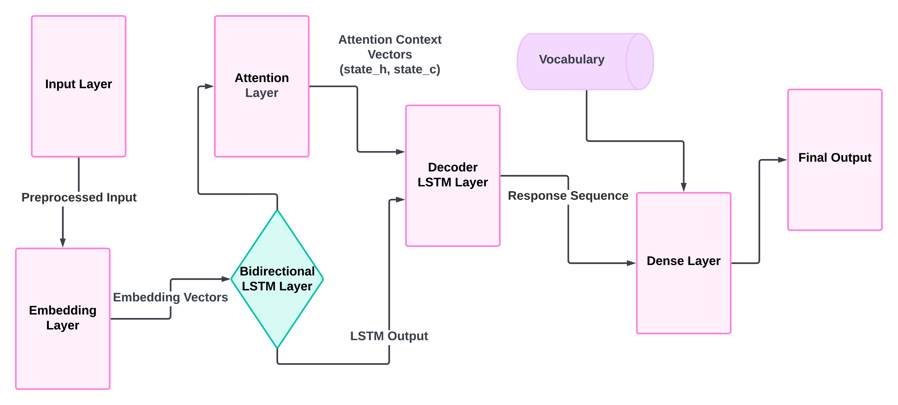

# Empathetic Chatbot
## Overview
Empathetic Chatbot is a project aimed at creating a chatbot that can understand and respond with empathy. The goal is to enhance human-computer interaction by making conversations more natural and emotionally intelligent. This project is part of a dissertation focused on developing an emotionally intelligent chatbot for student support services.

## Files and Their Purposes
- `attention/simple.ipynb`: Simple attention implementation with a dummy dataset.
- `attention/chatbot.ipynb`: Actual chatbot implementation which generates the model file `chatbot.h5`, associated weight `model_weights.h5` and vocal file `vocab.h5`.
- `attention/inference.ipynb`: Notebook for inference.
- `dataset/empatheticdialogues/`: Directory containing training, testing, and validation datasets (`train.csv`, `test.csv`, `valid.csv`).
- `dataset/glove/`: Directory containing GloVe embeddings.

## Note
An update to this project is coming soon. Stay tuned for more information and improvements!

## References
- [Empathetic Dialogues Dataset](https://github.com/facebookresearch/EmpatheticDialogues)
- [GloVe: Global Vectors for Word Representation](https://nlp.stanford.edu/projects/glove/)
- [Attention Mechanism in Neural Networks](https://arxiv.org/abs/1409.0473)